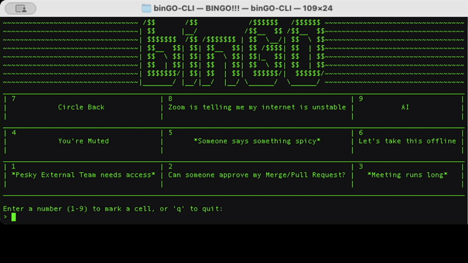

```bash
 /$$       /$$            /$$$$$$   /$$$$$$ 
| $$      |__/           /$$__  $$ /$$__  $$
| $$$$$$$  /$$ /$$$$$$$ | $$  \__/| $$  \ $$
| $$__  $$| $$| $$__  $$| $$ /$$$$| $$  | $$
| $$  \ $$| $$| $$  \ $$| $$|_  $$| $$  | $$
| $$  | $$| $$| $$  | $$| $$  \ $$| $$  | $$
| $$$$$$$/| $$| $$  | $$|  $$$$$$/|  $$$$$$/
|_______/ |__/|__/  |__/ \______/  \______/ 

```
# binGO-CLI



A terminal bingo game written in Go for quick fun in meetings. Reads phrases from `buzzwords.csv` and displays a 3x3 bingo board. Supports single-player (no dependencies) and multiplayer via WebSocket.

## Requirements

**To play immediately:** Just download a prebuilt binary (see Quick Start)—no setup needed!

**To build from source:**
- Go 1.25+ (the project `go.mod` currently specifies `go 1.25.3`)

## Quick Start - Prebuilt Binaries

Pre-compiled binaries are available in GitHub Releases for:
- **macOS Intel (base)**: `binGO-CLI-intel-mac`
- **Linux x86_64**: `binGO-CLI-linux`

### Download & Run

1. **Download** the binary for your platform from the [latest release](https://github.com/jkMLnop/binGO-CLI/releases):
   ```bash
   # macOS Intel
   wget https://github.com/jkMLnop/binGO-CLI/releases/latest/download/binGO-CLI-intel-mac
   chmod +x binGO-CLI-intel-mac
   ./binGO-CLI-intel-mac -mode standalone
   
   # Linux x86_64
   wget https://github.com/jkMLnop/binGO-CLI/releases/latest/download/binGO-CLI-linux
   chmod +x binGO-CLI-linux
   ./binGO-CLI-linux -mode standalone
   ```

2. **Or download manually:**
   - Visit [binGO-CLI Releases](https://github.com/jkMLnop/binGO-CLI/releases)
   - Download the binary for your OS
   - `chmod +x` the downloaded file
   - Run it: `./binGO-CLI-intel-mac -mode standalone` (or `-linux` for Linux)

## Build from Source

```bash
# Build
cd /path/to/binGO-CLI
go build -o binGO-CLI
chmod +x binGO-CLI

# Or run directly without building
go run . -mode standalone
```

## Modes

- **`standalone`** (default): Single-player game, no networking
  ```bash
  ./binGO-CLI -mode standalone
  ```

- **`server`**: Start WebSocket server (multiplayer)
  ```bash
  ./binGO-CLI -mode server -port 8080
  ```

- **`client`**: Connect to a WebSocket server and play multiplayer
  ```bash
  ./binGO-CLI -mode client -server localhost:8080
  ```

## Usage

### Standalone Mode
- The program reads `buzzwords.csv` in the project root and uses the first column of each row.
- Each cell displays its numpad number (1-9) in the top-left, with the phrase centered below.
- Enter a number 1-9 to mark the corresponding cell; enter `q` to quit.
- Win by marking three in a row (horizontal, vertical, or diagonal).

### Multiplayer Mode (Client/Server)

#### Option 1: Local Network
1. **On the server machine:**
   ```bash
   ./binGO-CLI -mode server -port 8080
   ```

2. **On client machines (same WiFi):**
   ```bash
   ./binGO-CLI -mode client -server <server-ip>:8080
   ```
   Find your server's local IP with `ifconfig | grep "inet " | grep -v 127.0.0.1 | head -1 | awk '{print $2}'` (macOS) or `hostname -I` (Linux)

**Note:** Local network connections automatically join the game without requiring a code.

#### Option 2: Internet via ngrok (with Game Code)

ngrok creates a public tunnel to your local server using a reverse proxy. Your machine initiates an outgoing connection to ngrok's servers, which then routes inbound traffic from the internet back through that connection—bypassing ISP firewalls that block direct inbound connections. Perfect for testing multiplayer across the internet without cloud hosting.

**Important:** Remote connections via ngrok require a game code for security. Codes are automatically generated and displayed to all connected players.

**Requirements:**
- ngrok **3.0.0+** (tested with 3.34.1). Free tier requires HTTPS/WSS connections. [Download here](https://ngrok.com/download)

1. **Install ngrok** (free account required):
   ```bash
   brew install ngrok  # macOS
   # or visit https://ngrok.com/download
   ```

2. **Create free account** at https://dashboard.ngrok.com/signup and get your authtoken from https://dashboard.ngrok.com/get-started/your-authtoken

3. **Add authtoken:**
   ```bash
   ngrok config add-authtoken YOUR_TOKEN_HERE
   ```

4. **Start your server:**
   ```bash
   ./binGO-CLI -mode server -port 8080
   ```

5. **In another terminal, expose with ngrok:**
   ```bash
   ngrok http 8080
   ```
   You'll see output like:
   ```
   Forwarding    https://abc123xyz.ngrok-free.dev -> http://localhost:8080
   ```
   _(Note: ngrok 3.0+ free tier requires HTTPS/WSS. The client automatically detects ngrok domains and uses secure WebSocket (`wss://`) connections.)_

6. **Share the ngrok URL and game code with friends.** They connect with:
   ```bash
   ./binGO-CLI -mode client -server abc123xyz.ngrok-free.dev -code BINGO-XXXXX
   ```
   Replace `BINGO-XXXXX` with the actual game code shown on the server.
   
   _(The client auto-detects ngrok domains and connects securely without needing to specify `wss://`)_

### Gameplay

- Enter a number (1-9) to mark a cell
- Enter `board` to redisplay the board
- First player to get 3 in a row (horizontal, vertical, diagonal) wins
- Winner sees a celebration animation, all players exit

## Board Sizes
- **3x3 Speed Bingo** (current): Quick 9-cell game with numpad numbers 1-9
- **5x5 Classic Bingo** (planned): Traditional 25-cell board with B-I-N-G-O letters and numbers 1-5

## Architecture

```
binGO-CLI/
├── bin.go                      # Main entry point & CLI modes
├── client/                     # Multiplayer CLI client
│   ├── auth.go                 # Local session management (token storage, username prompts)
│   ├── auth_test.go            # Auth tests
│   ├── player.go               # Connection, board sync, input handling
│   ├── display.go              # Client-side UI rendering
│   └── types.go                # Client message types
├── server/                     # Multiplayer WebSocket server
│   ├── auth.go                 # JWT token generation & validation (IP-bound)
│   ├── auth_test.go            # Auth unit tests
│   ├── server.go               # WebSocket handler, game coordination
│   ├── server_test.go          # Server unit tests
│   ├── game.go                 # Player & Game structs with thread-safe operations
│   ├── api.go                  # REST API endpoints (game lookup, leaderboard, status)
│   ├── api_test.go             # API endpoint tests
│   ├── db.go                   # Database integration & helpers
│   ├── player_db.go            # Player database tracking
│   ├── types.go                # Message types
│   ├── utils.go                # Utility functions
│   └── utils_test.go           # Utility tests
├── shared/                     # Shared game logic (all modes)
│   ├── board.go                # Board management, cell marking, win detection
│   ├── board_test.go           # Board unit tests
│   ├── display.go              # Terminal rendering and formatting
│   ├── display_test.go         # Display unit tests
│   ├── types.go                # Type definitions
│   ├── utils.go                # CSV loading utilities
│   └── utils_test.go           # Utility tests
├── standalone/                 # Single-player mode
│   └── player.go               # Game loop & input handling
├── db/                         # Database layer (Phase 7.5)
│   ├── store.go                # GameStore interface (abstract DB operations)
│   ├── sqlite.go               # SQLite implementation with full CRUD
│   └── sqlite_test.go          # Database unit tests
├── tests/                      # Integration & regression tests
│   ├── multiplayer_test.go     # 8+ multiplayer integration tests
│   ├── db_integration_test.go  # 7 database persistence tests (Phase 7.5)
│   ├── README.md               # Test documentation
│   └── REGRESSION_TESTS.md     # 49 manual regression tests
├── buzzwords.csv               # Default sample dataset
├── buzzwords_full.csv          # Extended buzzword set
├── bingo.db                    # SQLite database (created with -db flag)
├── go.mod                      # Go module dependencies
├── go.sum                       # Dependency checksums
├── CHANGELOG.md                # Version history
├── LICENSE                     # MIT license
└── binGO*                      # Prebuilt binaries (macOS, Linux)
    ├── binGO                   # Apple Silicon binary (arm64)
    ├── binGO-CLI-intel-mac     # Intel Mac binary (amd64)
    └── binGO-CLI-linux         # Linux binary (amd64)
```

## Data
`buzzwords.csv` is included as a sample dataset. If you replace it with your own file, keep the same CSV format (one phrase per row, first column used).

## Testing

Run tests locally with `go test ./...` or see [tests/README.md](tests/README.md) for detailed test documentation.

## CI/CD & Releases

This repo uses GitHub Actions to automatically:
- **Test**: Run full test suite on every push and PR
- **Build**: Compile binaries for macOS Intel and Linux x86_64
- **Release**: Create GitHub releases with checksums when you push a tag

### Creating a Release

Simply tag your commit:
```bash
git tag v1.0.0
git push origin v1.0.0
```

GitHub Actions will:
1. Run all tests
2. Build binaries for both platforms
3. Create a release with both binaries + SHA256 checksums
4. Binaries available at: `https://github.com/jkMLnop/binGO-CLI/releases`

(Free tier GitHub Actions: 2,000 minutes/month—this workflow uses ~2 min per run)

## TODO

#### Phase 7.5: Production Database & Cloud Deployment
**Goal:** Move from ngrok to persistent cloud server (bingoserver.live) with database

**Tasks:**
- [x] Database schema (SQLite initially)
  - `hosts` table: id, username, approved_buzzwords (JSON), created_at
  - `games` table: id, code, host_id, status, buzzwords (JSON), winner_id, created_at, ended_at, expires_at (4-day cleanup)
  - `players` table: id, game_id, username, ip_address, is_host, joined_at, left_at
  - `wins_history` table: player_username, game_code, won_at (survives game deletion for leaderboards)
  
- [x] Abstract database layer (interface-based for future K8s migration)
  - `db/store.go`: GameStore interface (CreateGame, GetGameByCode, UpdateGame, etc.)
  - `db/sqlite.go`: SQLite implementation with full CRUD operations
  - All game, player, host, and leaderboard operations complete
  - Design allows easy swap to PostgreSQL later without app changes

- [x] HTTP API for web client support
  - `GET /api/game/:code` validates game code and returns metadata (GameInfo)
  - `GET /api/leaderboard?limit=10` returns top players with ranks
  - `GET /api/status` returns server health status
  - Hybrid access pattern (in-memory + database fallback)
  - Enables web client URL routing (bingoserver.live/game/ABC123) in Phase 11

- [x] Comprehensive integration tests
  - `tests/db_integration_test.go`: 7 database & API tests
  - TestGameCreationPersistence, TestPlayerJoinPersistence, TestWinRecording
  - TestLeaderboardAccuracy, TestAPIGameLookup, TestAPILeaderboardEndpoint
  - TestGameExpirationCleanup
  - All 7/7 tests passing ✅

- [x] Command-line flag support
  - `-db <path>` flag to enable SQLite database persistence
  - Server automatically initializes and uses database when flag provided
  - Backward compatible: database optional, all modes work without it
  - Usage: `./binGO -mode server -port 8080 -db ./bingo.db`

- [ ] Docker containerization
  - Dockerfile for server binary + SQLite
  - docker-compose.yml for local testing
  - Fly.io config for deployment

- [ ] Deploy to Fly.io
  - Point `bingoserver.live` DNS to Fly.io instance
  - Use Fly.io persistent volume for SQLite data
  - Test: `./binGO-CLI -mode client -server bingoserver.live`

#### Phase 8: Production Hardening & Scaling
**Goal:** Make cloud server reliable under load

**Tasks:**
- [ ] Multi-game stability testing
  - Load test with dozens of concurrent games
  - Verify game isolation (games don't interfere)
  - Connection cleanup on client disconnect

- [ ] Game lifecycle management
  - Auto-cleanup: Delete games older than 4 days (after archiving to wins_history)
  - Orphaned game detection (host left, no players remaining)
  - Graceful shutdown handling

- [ ] Security hardening
  - Rate limiting (prevent code brute-force)
  - DDoS mitigation (connection limits per IP)
  - Logging/monitoring for abuse patterns

- [ ] Observability & Monitoring (critical for load testing insights)
  - Prometheus metrics endpoint (`/metrics`)
    - `game_count` (total active games)
    - `player_count` (total connected players)
    - `game_creation_duration_ms` (latency)
    - `database_query_duration_ms` (DB performance)
  - Structured JSON logging
    - Game lifecycle events (created, ended, restarted, archived)
    - Player connection events (joined, disconnected, errors)
    - Database performance issues
  - Grafana dashboard
    - Games created per minute
    - Average players per game
    - Error rate & error types
    - Database query latency histogram
  - Alert thresholds
    - Error rate > 5%
    - Game creation latency > 500ms
    - Database connection pool exhaustion

#### Phase 9: Client Features & Improved UX
**Goal:** Support hosting games on cloud server; add leaderboards; support custom buzzword lists

**Tasks:**
- [ ] Client menu system (Host vs Join)
  ```
  Connect to bingoserver.live?
  1) Host a new game
  2) Join existing game (with code)
  ```
  - Option 1: Host workflow
    - Prompt: "Enter path to JSON buzzword file (or 'skip' for defaults)"
    - If path provided: Validate JSON format, upload to server
    - If skip: Use default buzzwords.csv
    - Server creates game, assigns code, display to user
  - Option 2: Join workflow
    - Prompt for code, validate, join
  - Display game code in CLI (e.g., "Game code: ABC123")

- [ ] Buzzword suggestion system (in-game)
  - Players suggest via chat: `add_new_phrase <phrase>`
  - Suggestions ephemeral (in-memory only, no DB storage)
  - Host approves: `approve <phrase>` → adds to both current game AND host profile, saves to DB
  - Host rejects: `reject <phrase>` → discarded immediately (not stored)
  - When host creates new game: Inherits approved buzzwords from their profile
  - Host can also upload custom JSON on game creation (overrides their profile list)
  - Chat UI displays suggestion broadcasts and outcomes

- [ ] Leaderboard queries
  - Query wins_history to display top players
  - Display personal stats (wins, games played)

- [ ] Updated help text with new commands

#### Phase 10: Kubernetes & Scaling (Future)
**Goal:** Run multiple server instances with shared database

**Tasks:**
- [ ] PostgreSQL migration
  - Replace SQLite with PostgreSQL (same schema)
  - Use prepared statements for connection pooling
  - No app code changes needed (thanks to GameStore interface)

- [ ] Kubernetes deployment
  - Helm chart for server deployment
  - Persistent volume claims for PostgreSQL
  - Service mesh / ingress configuration
  - Horizontal pod autoscaling

- [ ] Distributed tracing (multi-pod debugging)
  - Jaeger integration for request tracing across pods
  - Trace game creation from client request → DB write → response
  - Identify cross-pod bottlenecks
  - Debug session correlation (which pod handled which request)

- [ ] Testing under K8s
  - Multi-replica game coordination
  - Database failover scenarios
  - Performance benchmarking under load

#### Phase 11: Web Client & Shareable Links
**Goal:** Browser-based bingo client with URL-based game sharing (like Zoom meeting links)

**Tasks:**
- [ ] Web client (React + TypeScript)
  - Game board UI (3x3 grid with click-to-mark)
  - WebSocket integration (same protocol as CLI)
  - Player list + join form
  - Leaderboard display

- [ ] Shareable links feature
  - URL routing: `bingoserver.live/game/ABC123`
  - Server `GET /api/game/:code` endpoint (added in Phase 7.5) validates code
  - Web client pre-populates game code from URL
  - Share button copies link to clipboard
  - Works seamlessly from Phase 7.5 server endpoint

- [ ] CLI integration
  - When host creates game, display shareable link:
    ```
    Game created! Code: ABC123
    Share this link: https://bingoserver.live/game/ABC123
    Or use code with CLI: ./binGO-CLI -mode client -server bingoserver.live -code ABC123
    ```

- [ ] Mobile optimization
  - Responsive design (works on phone/tablet)
  - Touch-friendly board
  - PWA features (offline fallback)

---

**Notes:**
- Phase 7.5 is prerequisite for 8, 9, 11
- Phase 10 can happen anytime after 7.5 (GameStore abstraction enables it)
- Phase 11 requires Phase 7.5 `GET /api/game/:code` endpoint but can develop in parallel
- All phases keep backward compatibility with existing v1.0.0 clients
